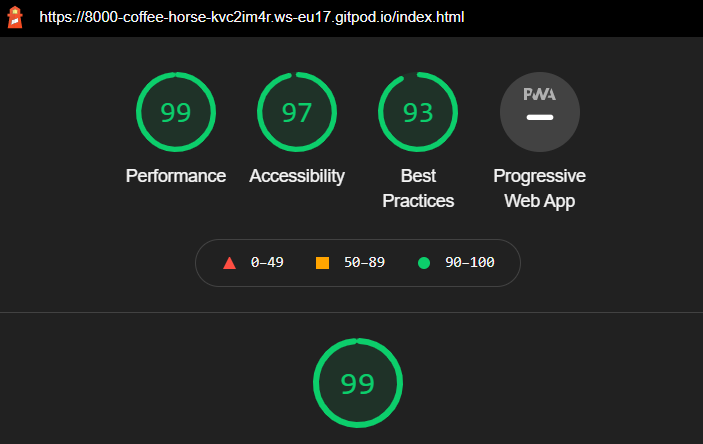
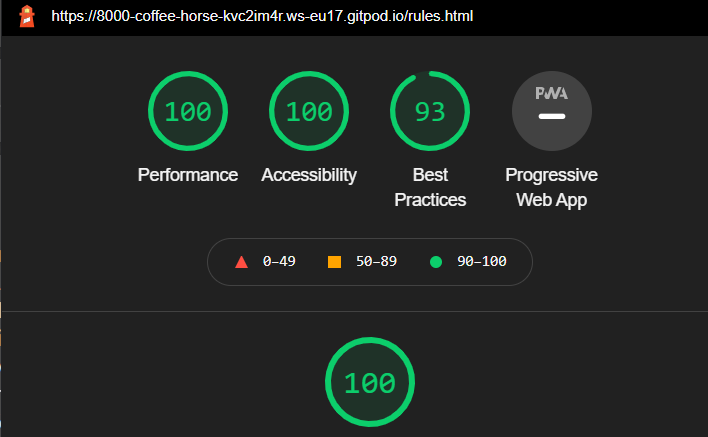
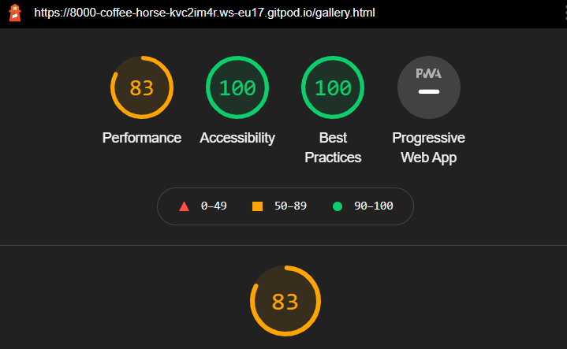
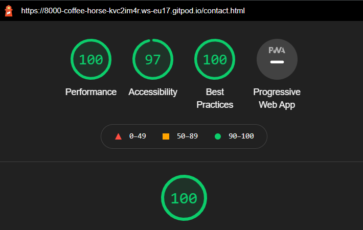
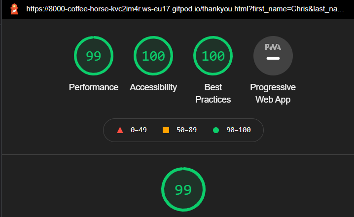

# PORTFOLIO PROJECT - 1
# TRIALS WORLD
[Here is a link to the final project](https://chr15w1986.github.io/Portfolio-1/)
## Purpose

Trials World is a website designed to educate people on the sport of trials riding, history of the sport, riders profiles, techniques and the different styles
of each part of the sport.

## Initial Idea Concept

My initial idea for the project was to create an informative website about the sport of mountain bike trials. My target audience is anyone who is interested in the sport or the history,
this can be anybody of any age, gender and interest level. The site is safe for all age ranges from children to adults who want to learn about the trials riding. I chose to make the site quite dark to keep the information bright for contrast purposes.

* The Features I wanted the project to have are:

    * To make the site easy to read,
    * Have a contrasting colour scheme (Light grey, Dark grey with off-white text)
    * Have an easy to navigate "Nav Bar" 
    * Look fun with images, 
    * And be educational.

## Final Design

## Contents

* Wireframes --------------------------------------------------------
## WIREFRAMES

WIREFRAMES can be viewed [here](assets/wireframes/wireframes.pdf)

## SOLVED BUGS AND ERRORS

* There was a bug on each page that was identified as a lack of `max-width` on the `body` element, I have since set this to `1920px`
* Youtube videos on the home page would overlap at screen widths smaller than `650px`. This was cured with the use of `position:relative` and `position:absolute`
* The `navbar` would always "hang" to the left until media queries kicked in at 440px, at which point the would centre align and stack. This was cured by the use of `display:grid`. Now they are inline, centred and responsive.
* Once the form on the contact page was filled in and the `GO!` button pressed, I wanted the next page to be a `Thankyou for contacting us` page. This didnt seem to work. The `form method="POST"` attribute that I was using was the culprit, This has now been changed to `form method="GET"` and it now works fine.
* On the `Thankyou for contacting us` page, the `Return to Home` but also didnt work the way I wanted it to, this was solved by wrapping the `input` element in a `form` element and giving the form a `method="GET"`.
* The four images on the main page were unresponsive, they either stacked or overlapped at any screen size below around 800px. This was sorted by setting up a `grid`. This then gave me the control to move the images where I wanted them at multiple screen widths.
* Any duplicate or unused selectors, classes, id's and elements have been removed.
* Any irrelevant space in between code has been removed.
* On Apple Safari Browser, the `HERE` link appeared black or darker, but didnt on android or chrome. Solved this by targeting the link directly and setting the colour to an off shade of white `#d6d4d4` rather than `inherit` to keep consistency throughout the page.

## UNSOLVED BUGS OR ERRORS
* The navbar `contact` link overflows as the screen gets below 270px wide.
* The `central images` on the home screen overflow on the right side of the screen below 270px wide.
* The two `Youtube videos` overflow (stop being responsive) when the screen width is below 270px wide.

# TESTING

The site has been tested through multiple tests on each individual page.

## Validators

* I ran all of my code through css-validator and html-validator, and I was given multiple errors of `grid-area-templates` and `misplaced end tag`. 
* I have since corrected these errors and run the validators again and have found no errors. [CSS screenshot](testing/css-no-errors.png) and [HTML screenshot](testing/html-no-errors.png)
There we also 5 warnings that still exist in CSS code. Although they are imported style sheets and vendor extensions which are needed for my code to work. [Warnings found here](testing/css-warnings.png)

* See [HERE](https://jigsaw.w3.org/css-validator/validator?uri=chr15w1986.github.io%2FPortfolio-1%2F&profile=css3svg&usermedium=all&warning=1&vextwarning=&lang=en) for the full report on CSS Validator.
* See [HERE](https://validator.w3.org/nu/?doc=https%3A%2F%2Fchr15w1986.github.io%2FPortfolio-1%2Findex.html) for the home page report on HTML Validator.
## Lighthouse

* I ran each page live through Chrome Lighthouse and received the following results with an average of 96.2% across the site.
    ### Home
    
    ### Rules
    
    ### Gallery
    
    ### Contact
    
    ### Thankyou
    

## Accessibility
# CREDITS AND REFERENCES

* Inspiredbicycles.com for the images
* Wikipedia.com for more indepth information on the sport of trials riding

