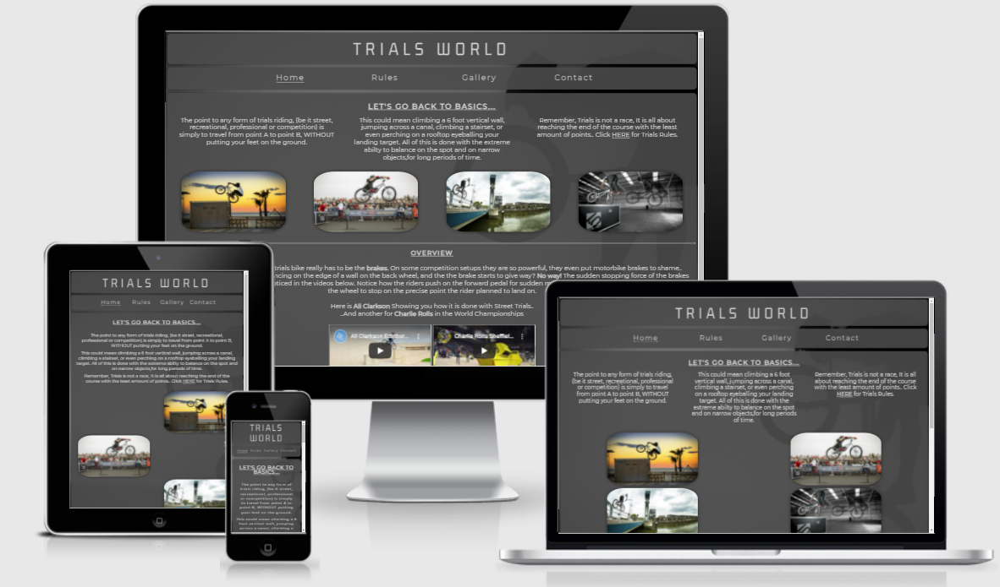
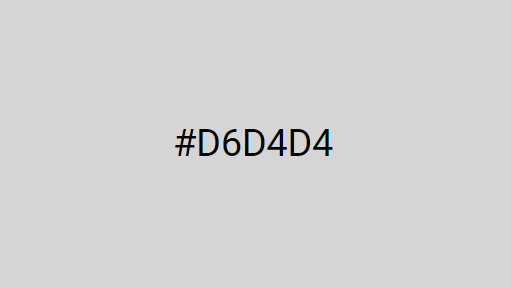
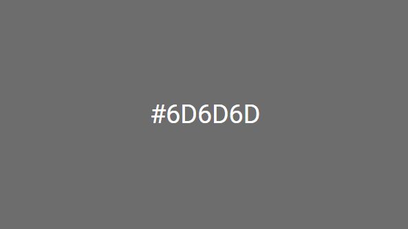
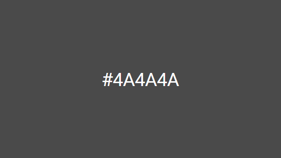

# PORTFOLIO PROJECT - 1

# TRIALS WORLD

## Purpose

Trials World is a website designed to educate people on the sport of trials riding, the history of the sport, riders, techniques and the different styles
of each part of the sport.
* [Here is a link to the final project](https://chr15w1986.github.io/Portfolio-1/)

## Initial Idea Concept

My initial idea for the project was to create an informative and educational website about the sport of mountain bike trials. My target audience is anyone who is interested in the sport itself or seeking information on the rules around the sport.
This can be any person of any age, gender and interest level. The site is safe for all age ranges from children to adults who want to learn about the trials riding. I chose to make the site quite dark to keep the information bright for contrast purposes.

* The Features I wanted the project to have are:

    * To make the site easy to read,
    * Have a contrasting colour scheme (Light grey, Dark grey with off-white text)
    * Have an easy to navigate "Nav Bar" 
    * Look fun with images, and be educational.

#  
## Final Design

#  
## CONTENTS

- [UX/UI](#uxui)
  * [USERSTORIES](#user-stories)
  * [WIREFRAMES](#wireframes)
  * [FEATURES](#features)
  * [DESIGN](#design)
- [TESTING](#testing)
  * [VALIDATORS](#validators)
  * [LIGHTHOUSE](#lighthouse)
  * [ACCESSIBILITY](#accessibility)
  * [SOLVED BUGS AND ERRORS](#solved-bugs-and-errors)
  * [UNSOLVED BUGS AND ERRORS](#)
  * [FUNCTIONALITY](#)
- [TECHNOLOGIES U](#TE)
  * []

#  
#
# UX/UI
* This website was created to show my knowledge of HTML and CSS and to provide users with visual and educational content. 
* The site should be simple to navigate.
* The sit should be easy to read, images should be clear without stretching or squashing.

Site Goals:

* To showcase my skills in HTML and CSS.
* To provide users with an easy to understand and easy to navigate website.
* To provide users with enough information to return to the website for projects and/or education.
* To make the site easily accessible.

## USER STORIES

* As a user, I want to easily understand the main purpose of the site.
* As a user, I want to be able to navigate the site easily.
* As a user, I want the site to be attractive.
* As a user, I want to be able to learn something new.
* As a user, I want to see images and videos related to the subject.

## WIREFRAMES

* Wireframes for mobile and desktop can be viewed [here](assets/wireframes/wireframes.pdf)

## FEATURES

* The site consists of: 
    * 4 main pages, `HOME, RULES, GALLERY, CONTACT` and an additional `THANKYOU` page.
    * Each page will have the same body layout, `HEADER (TITLE)`, `NAVBAR`, `MAIN CONTENT (TEXT AND IMAGES)` and `FOOTER (SOCIAL MEDIA ICONS/LINKS, TERMS/SMALLPRINT)`.

* Layout and content:
    * The Home page will have some introductory text and 4 images, followed by an overview of the site and two videos.
    * The Rules page will have information on the rules and styles of the sport including accompanying images.
    * The Gallery will have multiple images varying scenes in the sport of trials riding.
    * The Contact page will have a form to include first name, last name, email address and a submit button.
    * The Thankyou page with have some thankyou text and a thumbs up logo.

* Hover effect on links and social media icons:
    * Indicates to the user the location of the mouse whilst navigating the menu.
    * A Curved underline helps the user to know which page they are currently on.

* Contact Form:
    * Form validation requests the user to input the correct information in the input fields,
      This avoids the user sending illegible text/email.
## DESIGN
* Color Scheme:
    * With being a website that is both educational and fun, the color scheme chosen were shades of Grey. Both light, medium and dark grey were used for different elements of the site to provide a blend from background to foreground. The foreground text and images will be brighter and lighter than the background (Off white text)(See hex colours below). The difference between the darker background and lighter text brings contrast to the site and a definite seperation between the two.
  

* IMAGES
    * I sourced several images for the home page, rules page and gallery.
    * There are a total of 15 images across the site, including one for the background image.
    * All images have been compressed through `Tinypng.com`.
    * None of the images used have been pushed past the pixel limit in order to prevent image distortion.

* TYPOGRAPHY
    * The fonts used for my website is "Gemunu Libre" and "Monserrat". The font is imported from Google Fonts.

# 

# TESTING

The site has been tested through multiple tests on each individual page.

## Validators

* I ran all of my code through css-validator and html-validator, and I was given multiple errors of `grid-area-templates` and `misplaced end tag`. 
* I have since corrected these errors and run the validators again and have found no errors. [CSS screenshot](testing/css-no-errors.png) and [HTML screenshot](testing/html-no-errors.png)
* There we also 5 warnings that still exist in CSS code. Although they are imported style sheets and vendor extensions which are needed for my code to work. [Warnings found here](testing/css-warnings.png)

* See [HERE](https://jigsaw.w3.org/css-validator/validator?uri=chr15w1986.github.io%2FPortfolio-1%2F&profile=css3svg&usermedium=all&warning=1&vextwarning=&lang=en) for the full report on CSS Validator.
* See [HERE](https://validator.w3.org/nu/?doc=https%3A%2F%2Fchr15w1986.github.io%2FPortfolio-1%2Findex.html) for the home page report on HTML Validator.

## Lighthouse

* I ran each page live through Chrome Lighthouse and received the following results with an average of 96.2% across the site.

## Home

## Rules

## Gallery

## Contact

## Thankyou

## Accessibility

* Each page has been through wave.webaim.org for accessibility testing.
    * Found here: [Full Report](https://wave.webaim.org/report#/https://chr15w1986.github.io/Portfolio-1/index.html)

## SOLVED BUGS AND ERRORS

* I noticed a bug on each page that was identified as a lack of `max-width` on the `body` element, I have since set this to `1920px`
* Youtube videos on the home page would overlap at screen widths smaller than `650px`. This was cured with the use of `position:relative` and `position:absolute`.
* The `navbar` would always "hang" to the left until media queries kicked in at 440px, at which point the would centre align and stack. This was cured by the use of `display:grid`. Now they are inline, centred and responsive.
* Once the form on the contact page was filled in and the `GO!` button pressed, I wanted the next page to be a `Thankyou for contacting us` page. This didnt seem to work. The `form method="POST"` attribute that I was using seem to be the culprit, This has now been changed to `form method="GET"` and it now works fine.
* On the `Thankyou for contacting us` page, the `Return to Home` button didnt work the way I wanted it to, this was solved by wrapping the `input` element in a `form` element and giving the form a `method="GET"`.
* The four images on the main page were unresponsive, they either stacked or overlapped at any screen size below around 800px. This was sorted by setting up a `grid`. This then gave me the control to move the images where I wanted them at multiple screen widths.
* Any duplicate or unused selectors, classes, id's and elements have been removed.
* Any irrelevant space in between code has been removed.
* On Apple Safari Browser and Samsung Internet the `HERE` link appeared black or darker, but stayed white on chrome. Solved the issue on Safari by targeting the link directly and setting the colour to an off shade of white `#d6d4d4` rather than `inherit` to keep consistency throughout the page. This issue still exists on Samsung internet. The cause is `light-mode` and `dark-mode` settings on samsung phones which inverts colours, and not the code itself.

## UNSOLVED BUGS OR ERRORS
* The navbar `contact` link overflows as the screen gets below 270px wide.
* The `central images` on the home screen overflow on the right side of the screen below 270px wide.
* The two `Youtube videos` overflow (stop being responsive) when the screen width is below 270px wide.

## FUNCTIONALITY
* All links have been hovered over and clicked on to ensure accessibility.
* Pages all load correctly on all device screen sizes.
* All Social media links work correctly and open on a new tab.
* All images load on each page as intended.
#

# TECHNOLOGIES USED

* [HTML](https://en.wikipedia.org/wiki/HTML5)
* [CSS](https://en.wikipedia.org/wiki/CSS#CSS_3)

#
# DEPLOYMENT

* This site was deployed using GitHub Pages with the following the steps below:

1. Login or Sign Up to [GitHub](www.github.com).
2. Created a new repository called Project-1.
3. Next click on the `Settings` icon at the top of page in the navigation bar.
4. Scroll down until you see `Github Pages`.
5. There will be a message box saying "Check it out here" Click on the link to take you to the next page.
6. Here you will be greated with a form, Choose the repository `Project-1`.
7. Choose the branch in the drop down box, in this case `MAIN`.
8. Choose the directory in the next drop down box, in this case `Root`.
9. Then click `Save`.
10. It may take a few moments for the site to publish, but once live, the box at the top of the page with the site name will turn green and have a Blue tick to the left of the link to the live site.
#
# PROGRAMS USED

* GIT
  * For version control, commiting and pushing to github.
* GITPOD
  * The IDE used to code this website.
* GITHUB
  * Used to store repositories, files and images pushed from gitpod.
* Am I Responsive
  * Used to test responsiveness of the website at different screen sizes.
* CHROME Developer tools
  * For checking compatibilty, troubleshooting and editing code.
#
## CREDITS AND REFERENCES

* Inspiredbicycles.com for the images.
* Wikipedia.com for more indepth information on the sport of trials riding.
* UCI and BIU Association for the use of rules on the sport of trials riding.

#  

## ACKNOWLEDGEMENTS:

- Code institute for the tutors and mentors on the course.
- Matt bodden, for taking time out of his own studies to give his expert help and guidance with perfecting css.
- My family for their support and patience.
- Everybody on Slack for tips, advice, quick fixes and kind words.

